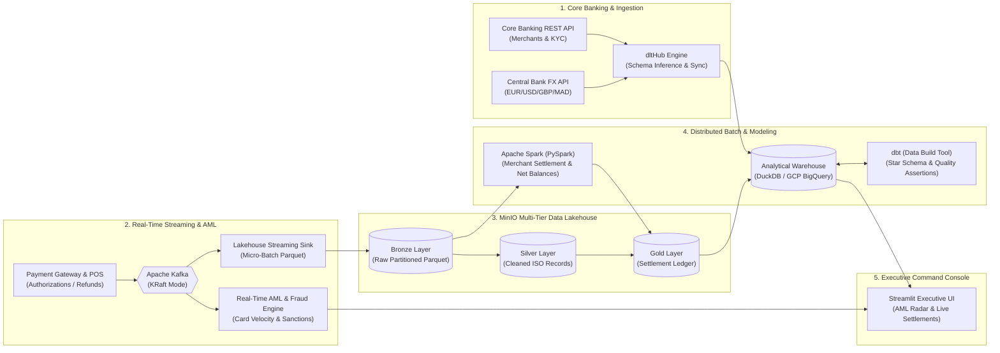

# PayPulse — Real-Time Payment Lakehouse & AML Intelligence Platform

[](https://python.org)
[](https://www.docker.com/)
[](https://kafka.apache.org/)
[](https://spark.apache.org/)
[](https://www.getdbt.com/)
[](https://kestra.io/)
[](https://github.com/Ghaberitsohaib/paypulse-data-platform/actions/workflows/ci.yml)

> **PayPulse** is a production-grade, enterprise-scale FinTech Lakehouse & Anti-Money Laundering (AML) platform designed to handle sub-second credit card transactions, cross-border multi-currency payments, automated merchant reconciliation, rolling reserve holdbacks, and real-time fraud scoring.

---

## 🏛️ End-to-End Architecture



---

## 🚀 Key FinTech Engineering Concepts Implemented

| Domain Concept | Implementation in PayPulse |
| :--- | :--- |
| **Idempotency & Exactly-Once** | Every payment authorization carries an immutable `idempotency_key` preventing duplicate charges. |
| **Multi-Currency Normalization** | Dynamic lookup of daily FX rates (USD, EUR, GBP, MAD) normalizing all ledgers to Base USD. |
| **Real-Time AML Fraud Radar** | Sliding window checks flagging rapid velocity bursts (<5s), micro-testing (<$2.00), and sanctions. |
| **Merchant Settlement Ledger** | Computes Gross Processing Volume (GPV), Interchange Fees, 5% Rolling Reserve holdback, and Net Payouts. |
| **Data Quality Assertions** | Automated **dbt tests** verifying non-negative transaction amounts, primary keys, and referential integrity. |
| **Infrastructure as Code (IaC)** | Modular **Terraform** provisioning GCP Cloud Storage buckets & partitioned BigQuery datasets. |

---

## 📁 Repository Structure

```
paypulse-data-platform/
├── docker-compose.yml              # Cluster: Postgres, Kafka, MinIO, Spark, Kestra, Dashboard
├── requirements.txt                # Python libraries
├── terraform/                      # Terraform GCP BigQuery & GCS Buckets
├── ingestion/                      # dltHub pipelines for FX rates & Merchant KYC
├── streaming/                      # Kafka payment producer, AML detector, lakehouse sink
├── batch/                          # PySpark merchant reconciliation & fee calculations
├── analytics_dbt/                  # dbt models (stg_*, dim_*, fct_*) & tests
├── orchestration/flows/            # Kestra declarative workflow DAGs
├── data_platform/                  # Streamlit Executive FinTech Dashboard
├── scripts/                        # Automated pipeline execution scripts
└── tests/                          # Automated pytest suite
```

---

## ⚡ Quickstart: Running in 30 Seconds

### 1. Install dependencies:
```bash
pip install -r requirements.txt
```

### 2. Execute the entire pipeline locally:
```bash
python scripts/run_pipeline.py
```

### 3. Launch the Executive FinTech & Fraud Dashboard:
```bash
streamlit run data_platform/dashboard.py
```
Open **`http://localhost:8501`** to view real-time transactions, trigger live payment bursts, and inspect AML fraud alerts!

---

## 🚢 Full Docker Multi-Container Cluster

```bash
docker compose up -d
```
- **Kestra Workflow Orchestration**: `http://localhost:8080`
- **Streamlit FinTech Dashboard**: `http://localhost:8501`
- **Kafka Stream Monitor**: `http://localhost:8085`
- **MinIO Lakehouse Console**: `http://localhost:9001`
- **Spark Master UI**: `http://localhost:8082`

---

## 💼 Portfolio Highlights for Recruiters
- **Critical High-Value Domain**: Demonstrates capability to process financial ledgers, audit trails, and anti-fraud compliance.
- **Top 2025/2026 Tech Stack**: **Kafka**, **PySpark**, **dbt**, **DuckDB/BigQuery**, **Kestra**, and **Terraform**.
- **100% Zero-Cloud-Cost Local Execution**: Clones and executes in seconds on any developer machine.
